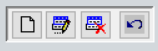

___________________________

# AUDITORÍA

 

_________________________
|  Funciones principales:  |
| :---------------------- |
|  [Crear usuarios](modulos/auditoria?id=crear-usuarios)|
| [Configurar permisos de Usuario](modulos/auditoria?id=configurar-permisos-de-usuario) |
| [Revisar Pistas de Auditoria](modulos/auditoria?id=revisar-pistas-de-auditorÍa) |
| [Igualar secuencias](modulos/auditoria?id=igualar-secuencias) |
 __________________________________________

## CREAR USUARIOS

> Mediante esta opción crearemos los usuarios personalizados según la actividad que desempeñen dentro de la empresa.

Dentro de la opción **"AUDITORÍA, CONFIGURACION"** seleccionamos **"ADMINISTRACIÓN DE USUARIOS"**

En la parte superior encontraremos los íconos de 
**"CREAR, EDITAR, ELIMINAR Y REGRESAR"**

Clic en **"CREAR"** para añadir un nuevo registro, y colocamos la siguiente información:

- **Nombre:**  ***Ej. CARLOS PÉREZ***

- **Login:** "Usuario" ***Ej. CARLOS***

-  **Clave:**  “Contraseña con números o letras” ***Ej. ABC123*** 

- **Confirmar Clave:** ***Ej. ABC123***     

- Marcamos las opciones **<u>Factura Preview y Punto Preview</u>**, la primera opción permite previsualizar las facturas antes de imprimirlas en el módulo de VENTAS y la segunda en el PUNTO DE VENTA.

- Para permitir que el usuario pueda acceder al módulo de AUDITORÍA y realice configuraciones del sistema, crear usuarios, revisar bitácoras, etc. Marcaremos la casilla <u>**AUDITOR**</u>. Caso contrario la dejamos desactivada.

- Finalmente damos clic en el botón de **GUARDAR** de la parte inferior, y ya podremos ingresar al sistema con nuestro nuevo usuario.

***Dependiendo del tipo de empresa y sus reglas internas se deben considerar llenar o modificar el resto de opciones***

__________________________________________________________

## CONFIGURAR PERMISOS DE USUARIO

> Dentro de **ADMINISTRACION DE USUARIOS** podemos configurar al usuario para permitirle o restringirle acciones específicas o el acceso total a los módulos.

Seleccionamos el usuario al que queremos configurar los permisos. 

* Damos clic al botón **ASIGNAR PERMISOS A USUARIO** ubicado en la parte inferior izquierda 
 

Observamos un amplio listado de permisos. Para activar o desactivar individualmente marcamos o desmarcamos las casillas de la parte derecha.

* Si desactivamos un encabezado, por ejemplo “MODULO: VENTAS", se negará el acceso total al módulo de ventas. 

- Si no queremos restringir todo el módulo, podemos seleccionar qué acciones específicas permitimos o impedimos al usuario.

 

Para facilitar este proceso usaremos los siguientes buscadores:

1. En el primero escribimos el permiso que estemos buscando, damos clic en la flecha azul las veces que sean necesarias hasta identificar la opción que queremos configurar. 

2. En el segundo recuadro podemos filtrar la búsqueda para que me muestre sólo las coincidendias. Ej. Colocamos la palabra MODULO** seguido del doble asterisco ***(esta expresión indica al sistema que filtre solo la palabra MODULO)***. De esta manera nos mostrará el encabezado de todos los módulo del sistema, así podremos activar o desactivar de forma rápida varios módulos.

- Finalmente damos clic en el botón de **GUARDAR** de la parte inferior.

***Para copiarle los mismos permisos a otros usuarios, desplegamos la pestaña de la parte inferior izquierda, seleccionamos otro usuario y damos clic en el visto.*** 

_________________________

## REVISAR PISTAS DE AUDITORÍA

>Hacemos clic en **PISTAS DE AUDITORÍA**. Esta opción permite obtener un seguimiento de todos los procesos, acciones y transacciones realizadas por cada usuario en los diferentes módulos del sistema. 

Para desplegar la información utilizamos el filtro por fechas, digitamos el periodo de tiempo  y damos clic en el VISTO. Nos mostrará las bitácoras de actividad del sistema conformadas por:

* **CÓDIGO:** Código de la acción realizada

* **ACCIÓN:** Actividad realizada por el usuario

* **USUARIO:** Qué usuario y desde qué computador realizó la actividad

* **TIEMPO:** Fecha y Hora del acceso

* **NOTA:** Descripción adicional de lo que se ha realizado

***Para facilitar la búsqueda activamos los filtros por USUARIO o por CÓDIGO de la parte superior.***

________________________

## IGUALAR SECUENCIAS

> Ingresamos a la opción **SECUENCIAS**. En esta opción podremos igualar las secuencias en facturas, notas de venta, notas de crédito, guías de remisión y demás documentos comerciales.

* Colocamos el establecimiento y punto de emisión cuyos documentos queremos igualar y hacemos clic en el botón de la carpeta.

* Hacemos clic en el nombre del documento que queremos modificar la secuencia, en este caso sobre la palabra "FACTURA". 

* El sistema nos pedirá la contraseña <u> (**"Nro. de usuario - contraseña"**)</u>       **Ejemplo:"4 - ABC123"**

* Dentro debemos colocar la última factura que emitimos. Supongamos que queremos que el sistema al momento de facturar nos muestre la secuencia nro. 60, por ende debemos colocar el nro. 59.

* Finalmente damos clic en el **VISTO** de la parte inferior, para guardar los cambios, el sistema nos volverá a solicitar la contraseña <u> (**"Nro. de usuario - contraseña"**) </u>

