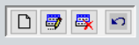

___________________________

# DIRECTORIO

 

_________________________
|  Funciones principales:  |
| :---------------------- |
|  [Cartera de Clientes](modulos/directorio?id=crear-cartera-de-clientes)|
| [Cartera de Proveedores](modulos/directorio?id=crear-cartera-de-proveedores) |
| [Otros](modulos/directorio?id=otros) |
____________________________

## CREAR CARTERA DE CLIENTES
>Cómo crear o modificar la información básica de los clientes de nuestra empresa

Ingresamos a la opción CLIENTES. Dentro se despliega el listado de clientes. En un sistema nuevo viene creado el **CONSUMIDOR FINAL** por defecto. 

En la parte superior encontraremos los íconos de 
**"CREAR, EDITAR, ELIMINAR Y REGRESAR"**

Clic en **"CREAR"** para añadir un nuevo registro, y colocamos la siguiente información:
 
-	**CLIENTE:** “NOMBRES COMPLETOS DEL CLIENTE” (se recomienda escribir primero apellidos y luego nombres) ***Ej. DELGADO BENITEZ LUIS JAVIER*** 

-	**COMERCIO:** “SI EL CLIENTE REPRESENTA UNA EMPRESA O COMERCIO” (El sistema por defecto autocompleta este campo con el mismo nombre del cliente, en caso de ser persona natural)

-	**DIRECCIÓN:** “LUGAR DE RESIDENCIA DEL CLIENTE” ***Ej. Barrio Época, calles Brasil y Honduras.***

-   **TIPO:** “SELECCIONE TIPO DE DOCUMENTO: **RUC, CEDULA, PASAPORTE**”

-	**RUC/CI:** “NUMERO DE DOCUMENTO” (acorde al tipo de documento seleccionado)

-	Una vez colocado el número de documento procedemos a dar clic en botón **WEB** 

    -   *Nota: Esta opción hace una búsqueda dentro de los servidores de TECSICOM CIA. LTDA, autocompleta la información de clientes o proveedores que han ingresado sus datos anteriormente en el sistema VISUALFAC. Debido a esto, en muchos casos no despliega información.* 

-	**EMAIL:** “e-mail del cliente” (necesario en caso de emitir documentos electrónicos)

-	**Telf(s):** “teléfono del cliente” (opcional)

-	**CELULAR:** “celular del cliente” (opcional)

-   Si el usuario que está creando al cliente es el **AUDITOR** le aparecerá en la parte derecha casillas para marcar como campo obligatorio para los demás a usuarios. 

- Finalmente damos clic en el botón de **GUARDAR** de la parte inferior.

 

***Con estos datos completados ya es posible utilizar el nuevo cliente, sin embargo, dependiendo de las necesidades y organización de la empresa se utilizan el resto de campos adicionales.*** 

## CREAR CARTERA DE PROVEEDORES

>Cómo crear y modificar la información básica de nuestros proveedores y distribuidores.

Ingresamos a proveedores. En la parte superior encontraremos los íconos de **"CREAR, EDITAR, ELIMINAR Y REGRESAR"**

Clic en **"CREAR"** para añadir un nuevo registro, y colocamos la siguiente información:

-	**RAZON SOCIAL:** ***“EJ. FERNANDEZ LUIS FELIPE”***

-	**NOMBRE COMERCIAL:** ***“EJ. CONSTRUCTORES CIA. LTDA.”*** (el sistema autocompleta este campo con la Razón Social, de no tener un nombre comercial)

-	**TIPO:** “SELECCIONE TIPO DE DOCUMENTO: **RUC, CEDULA, PASAPORTE**”

-	**NRO:** “NUMERO DE DOCUMENTO” (acorde al tipo de documento seleccionado)

- *En **RUC** y **TIPO** de documento, hacer clic o doble clic sobre la palabra “Tipo” o sobre la palabra “No.” para desbloquear los campos.*

-	Una vez colocado el número de documento procedemos a dar clic en botón **WEB** 

    -   *Nota: Esta opción hace una búsqueda dentro de los servidores de TECSICOM CIA. LTDA, autocompleta la información de clientes o proveedores que han ingresado sus datos anteriormente en el sistema VISUALFAC. Debido a esto, en muchos casos no despliega información.* 

-	**DIRECCIÓN:** ***“Ej. BARRIO ÉPOCA, CALLES BRASIL ENTRE HODURAS Y MARRUECOS”***

-	**E-MAIL:** (necesario en el caso de emitir documentos electrónicos)

-	**Teléfono:** (opcional)

-	**Celular:** (opcional)

-  Si el usuario que está creando al proveedor es el **AUDITOR** le aparecerá en la parte derecha casillas para marcar como campo obligatorio para los demás a usuarios. 

- Finalmente damos clic en el botón de **GUARDAR** de la parte inferior.

 

***Con estos datos completados ya es posible utilizar el nuevo proveedor, sin embargo, dependiendo de las necesidades y organización de la empresa se utilizan el resto de campos adicionales.*** 

## OTROS:

### GEOLOCALIZACIÓN DE CLIENTES PARA DISTRIBUIDORAS
______________________________

- **ASIGNAR GEOLOCALIZACIÓN TUTORIAL:**

<button style="border:none">  </button>

___________________________
  