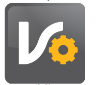

# EMPIEZA A UTILIZAR NUESTRO SISTEMA (primeros pasos)

## VERSIÓN DEMOSTRATIVA
_______________________________________

* **DESCARGAR VERSIÓN ACADÉMICA/DEMO:** 

<button style="border:none">  </button>

______________________________________

### CÓMO INICIAR EL SISTEMA

 
Ejecutamos el monitor y damos clic en **COMENZAR** Por defecto nos aparece el usuario llamado **“MONITOR”** y colocamos la contraseña que también es **“MONITOR”**. 

-    El **MONITOR** siempre debe permanecer abierto en el equipo servidor, este programa genera las bitácoras de actividad del sistema y permite que la información se guarde en la base de datos.
_________________________________________________

### INICIAR SESIÓN POR PRIMERA VEZ 

 
 

Ejecutamos el sistema **VISUALPLUS**. Para ingresar por primera vez utilizamos el usuario llamado **“USUARIO”** y la contraseña **“NUEVO”**. 
 

______________________________________

